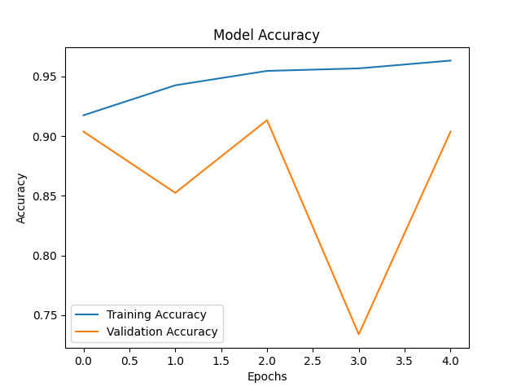

# Pneumonia Detection using VGG16


## Overview


This project implements a deep learning model to detect **pneumonia from chest X-ray images** using transfer learning with the VGG16 architecture.


The model is trained to classify X-ray images into two categories:


* **Normal**

* **Pneumonia**


This project demonstrates the application of **computer vision in medical diagnosis** using pre-trained convolutional neural networks.


---


## Problem Statement


Pneumonia is a serious lung infection that can be life-threatening if not detected early.

Manual diagnosis using X-ray images requires expertise and time.


This project aims to:


* Automate pneumonia detection

* Assist in faster diagnosis

* Reduce dependency on manual screening


---


## Tech Stack


* Python

* TensorFlow / Keras

* VGG16 (Transfer Learning)

* NumPy

* Matplotlib

* Pillow


---


## Project Structure


```text

pneumonia-detection-vgg16/

│── chest_xray/        # (not included - see dataset section)

│── models/            # trained model saved here

│── outputs/           # training plot

│── train.py           # model training script

│── predict.py         # single image prediction

│── requirements.txt

│── .gitignore

│── README.md

```


---


## Dataset


This project uses the **Chest X-Ray Pneumonia dataset** from Kaggle:


https://www.kaggle.com/datasets/paultimothymooney/chest-xray-pneumonia


Due to size limitations, the dataset is not included in this repository.


### Expected Dataset Structure


After downloading, place it like this:


```text

chest_xray/

│── train/

│   ├── NORMAL/

│   └── PNEUMONIA/

│── test/

│   ├── NORMAL/

│   └── PNEUMONIA/

│── val/

│   ├── NORMAL/

│   └── PNEUMONIA/

```


---


## How to Run


### Clone the repository


```bash

git clone https://github.com/Sanidhya1003/pneumonia-detection-vgg16.git

cd pneumonia-detection-vgg16

```


### Install dependencies


```bash

pip install -r requirements.txt

```


### Train the model


```bash

python train.py

```


### Predict on a new image


```bash

python predict.py chest_xray/test/NORMAL/NORMAL2-IM-0381-0001.jpeg

```


---


## Results


The model is able to classify chest X-ray images into:


* Normal

* Pneumonia




---


## Key Learnings


* Applied transfer learning using VGG16

* Worked with medical imaging datasets

* Implemented image preprocessing & augmentation

* Built an end-to-end ML pipeline (training + inference)

* Understood limitations of small datasets in deep learning


---


## Future Improvements


* Add confusion matrix & classification report

* Improve model performance using ResNet / EfficientNet

* Hyperparameter tuning

* Deploy as a web app (Streamlit / Flask)

* Add real-time prediction interface


---


## Author


**Sanidhya Shrivastava**


---


## Acknowledgements


* Kaggle dataset contributors

* TensorFlow & Keras documentation

